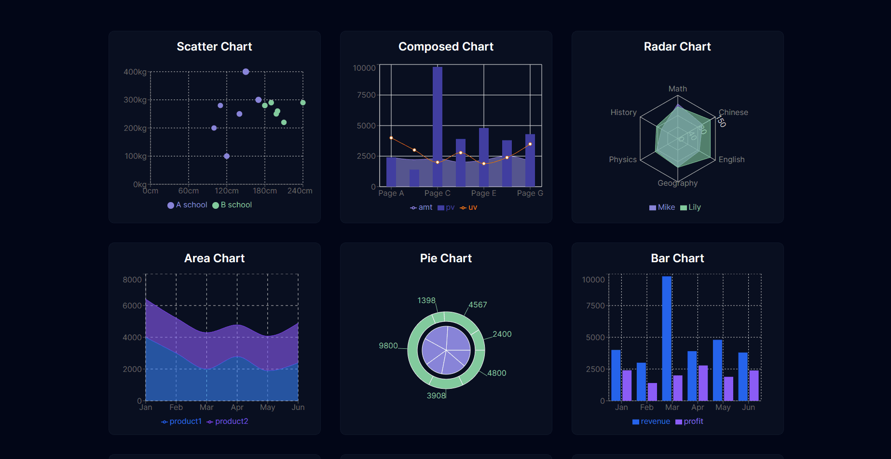
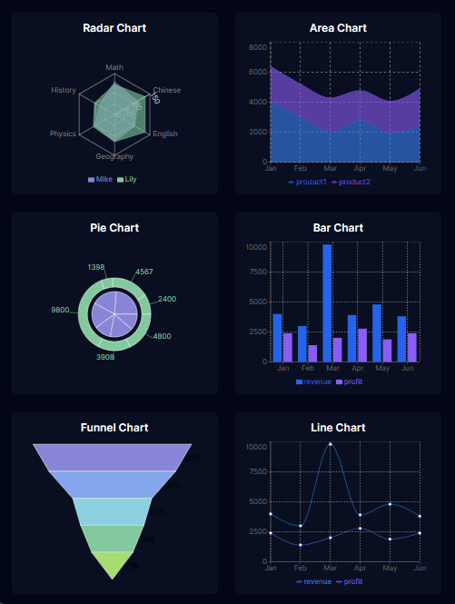
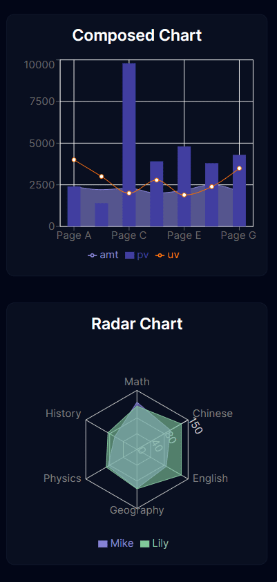
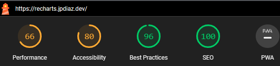

<div id="top"></div>

# Recharts Library 📊

Reacharts is a composable charting library for building charts with ease. It is built on top of D3. This library is a wrapper around D3 and it is used to create beautiful charts in React.

Learn more about [Recharts](http://recharts.org/en-US/).

<div align="center">

[](https://recharts.jpdiaz.dev/)
[](https://stackblitz.com/github.com/JuanPabloDiaz/recharts)

</div>

In this repository, you'll find the following charts:

- Line Chart
- Area Chart
- Bar Chart
- Pie Chart
- Scatter Chart
- Composed Chart
- Customized Dot Line Chart

### Desktop View 🖥️



### iPad view 📱



### Mobile view 📱



### Lighthouse Score 🚀



### Built With 🔑

Welcome to the [recharts](https://recharts.jpdiaz.dev), collection.


## Get started 🛠️

To get started with [recharts](https://recharts.jpdiaz.dev), simply clone the repository and follow the setup instructions. You'll be up and running in no time!

### Setup 📋

1. Clone the repo
2. Install dependencies
   ```sh
   npm install
   ```
3. Start the development server
   ```sh
   npm run dev
   ```
4. Open [http://localhost:3000/](http://localhost:3000/) with your browser to see the result.

## Contribution 🤝

I welcome contributions to the repo! Feel free to fork the repository and submit pull requests with your improvements.

### Contributors

<a href="https://github.com/JuanPabloDiaz/recharts/graphs/contributors"></a><!-- Made with [contrib.rocks](https://contrib.rocks). -->

## License 📜

[recharts](https://recharts.jpdiaz.dev) is licensed under the MIT License.

I hope you enjoy using the recharts repo!

<!-- ACKNOWLEDGMENTS -->

## Acknowledgments 📚

Resources list that I find helpful and would like to give credit to.

[](http://recharts.org/en-US/)
[](https://www.youtube.com/watch?v=Fu_YFp-9xoQ)
[](https://github.com/CodeSnaps/recharts-library)
[](https://tailwindcss.com/)
[](https://nextjs.org/)
[](https://vercel.com/)

<p align="right">(<a href="#top">👆 Top 👆</a>)</p>
